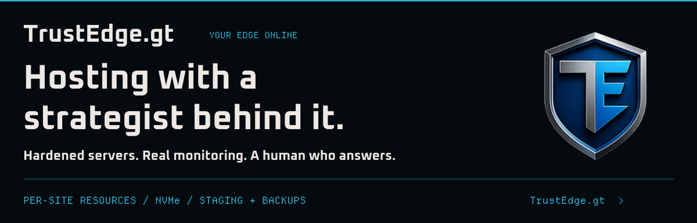
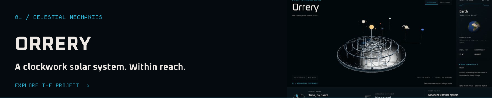
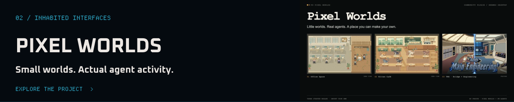
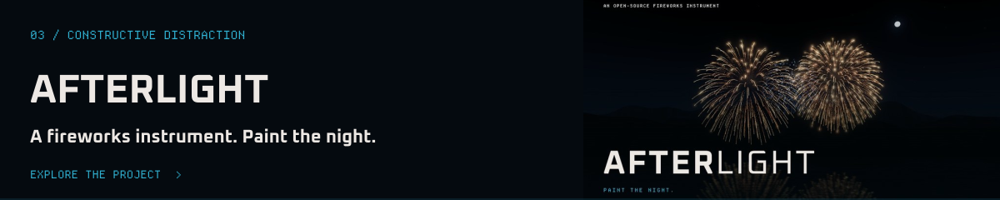

<a href="https://prodyn.ai/"><picture><source media="(prefers-reduced-motion: reduce) and (max-width: 640px)" srcset="assets/hero-mobile-static.svg?v=2"><source media="(prefers-reduced-motion: reduce)" srcset="assets/hero-static.svg?v=2"><source media="(max-width: 640px)" srcset="assets/hero-mobile.svg?v=2"></picture></a>

## I experiment with ways to make complicated systems visible, useful, and enjoyable to interact with.

I’m **Chris Mish**. I work across networks, hosting, systems, and software at **[Promethean Dynamic](https://promethean-dynamic.com/)**. I like making complicated things understandable, reliable, and good to spend time with.

[Promethean Dynamic](https://promethean-dynamic.com/) · [ProDyn.ai](https://prodyn.ai/) · [TrustEdge.gt](https://trustedge.gt/) · [Talk shop](mailto:chrism@promethean-dynamic.com)

### Current focus // 01 · TrustEdge.gt

<a href="https://trustedge.gt/"><picture><source media="(max-width: 640px)" srcset="assets/trustedge-mobile.svg"></picture></a>

I’ve been making technology do crazy things since 1998. At [TrustEdge.gt](https://trustedge.gt/), I put that experience into hosting that’s carefully run, with someone you can talk to about what you’re trying to build.

- **Know what you’re getting.** Published CPU and memory allocations per website, with NVMe storage.
- **Room to work properly.** Staging, caching, and backups. No per-visit, mailbox, or database count limits, within your plan’s resources.
- **A person behind the platform.** Hardened servers, real monitoring, and someone to talk through the setup with.

**[Find your hosting plan →](https://trustedge.gt/category/hosting)** · [Ask me about your setup](mailto:chrism@promethean-dynamic.com)

Building with agents?

Agent hosting is available experimentally on eligible plans. OpenClaw has a beta control-panel installation path; Hermes Agent can be set up manually on request. [See what’s available](https://trustedge.gt/add-an-agent.html).

### Built for the curiosity of it

[ProDyn.ai](https://prodyn.ai/) is home to my most active work and AI toybox: clockwork solar systems, tiny worlds for agents, and a slightly unreasonable interest in things that light up.

<a href="https://orrery.prodyn.ai/"><picture><source media="(max-width: 640px)" srcset="assets/orrery-mobile.svg"></picture></a>

[Source](https://github.com/cygnostik/orrery) · Mechanical and astronomical views. Runs in your browser.

<a href="https://github.com/cygnostik/pd-pixel-worlds"><picture><source media="(max-width: 640px)" srcset="assets/pd-pixel-worlds-mobile.svg"></picture></a>

[Browse the realms](https://github.com/cygnostik/pd-pixel-worlds/blob/main/realms/README.md) · A little more life beside the work.

<a href="https://fireworks.prodyn.ai/"><picture><source media="(max-width: 640px)" srcset="assets/prodyn-fireworks-mobile.svg"></picture></a>

[Source](https://github.com/cygnostik/prodyn-fireworks) · Compose a show. Or just set something off.

[Operations Surface](https://github.com/cygnostik/operations-surface) · A dummy console starter concept.

---

**Serious about the systems. Still here for the blinkenlights.**
